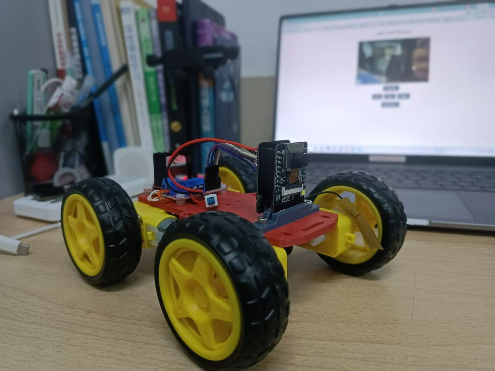
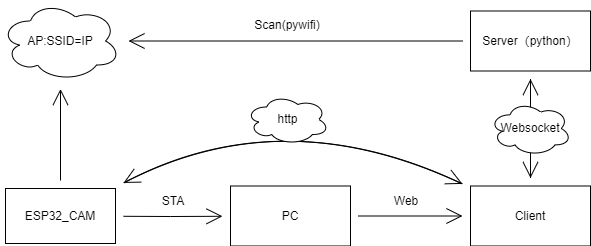
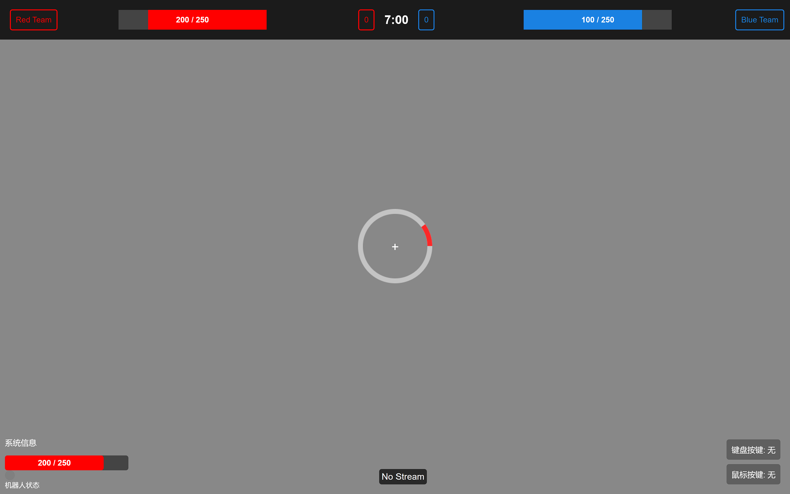
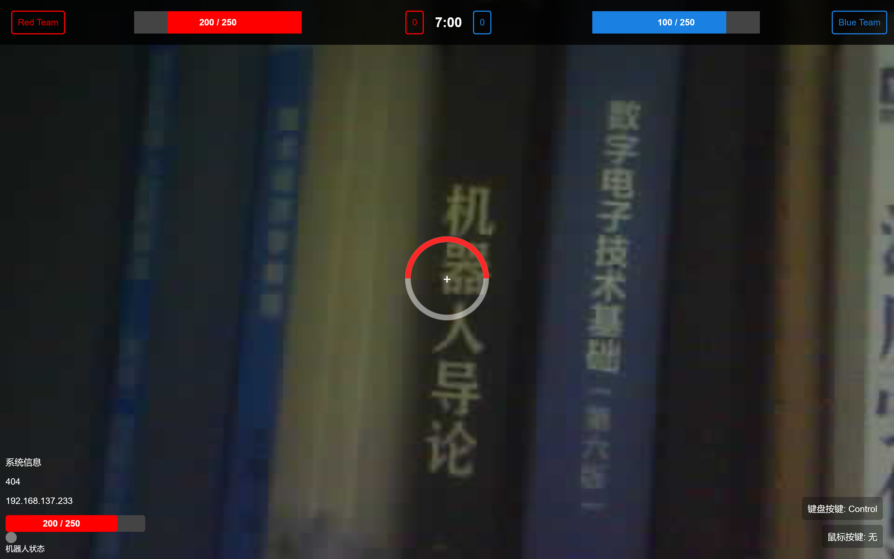
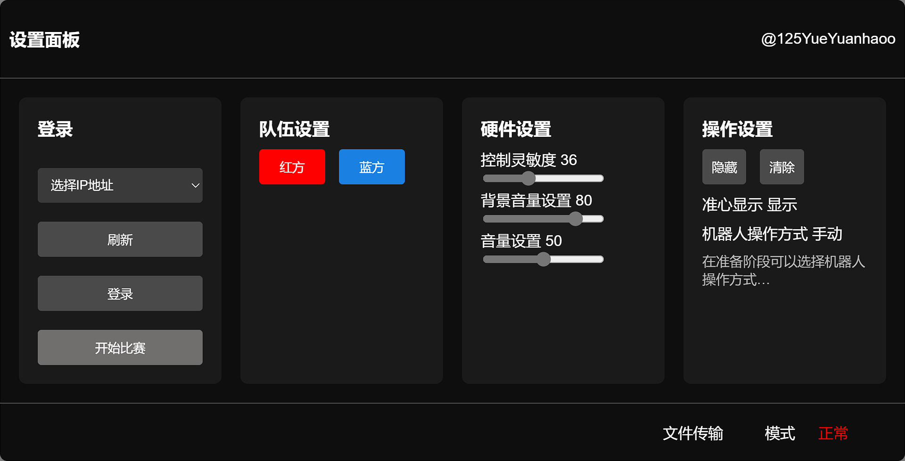

# 基于ESP32_CAM的无感链接小车

ESP32视频小车



## 硬件设计

- ESP32-CAM
  
## 软件设计

``` file tree
TUP_Robot/
├─.vscode
├─doc
├─HTML #HTML测试文件
├─Python #Python测试文件
│  ├─CHeck_IP
│  ├─Flask_test
│  ├─Get_local
│  ├─ScanWiFi
│  ├─Scapy
│  ├─UDP
│  └─WebSocket
├─Source #官方例程
│  └─CameraWebServer
├─TUP_Robot #单片机文件
│  ├─wificar #AP版
│  ├─wificar_sta #STA版
│  └─wificar_udp #UDP版（待测试）
└─WebView
    ├─audio
    ├─images
    ├─css
    └─js
    index.html #主页
```

## 通信框架



## 交互设计

### 欢迎界面


### 主界面



视频链接画面



### 设置界面

按P键进入设置界面



### 按键交互

- WASD 控制方向
- 左键 射击
- 待开发（可在WebView/js/scripts.js中添加）

## 使用

``` git bash

git clone https://github.com/TUP_Robot.git

```

### PC端

将热点名称改为TUP_Robot

将热点密码改为12345678

### 单片机

烧录TUP_Robot/wificar_sta.ino

### 网页端

打开WebView中的index.html文件

运行WebSocket.py

### 客户端

下载最新版release，TUP_Client客户端

## 注意

## 后续改进

@125YueYuanhaoo
